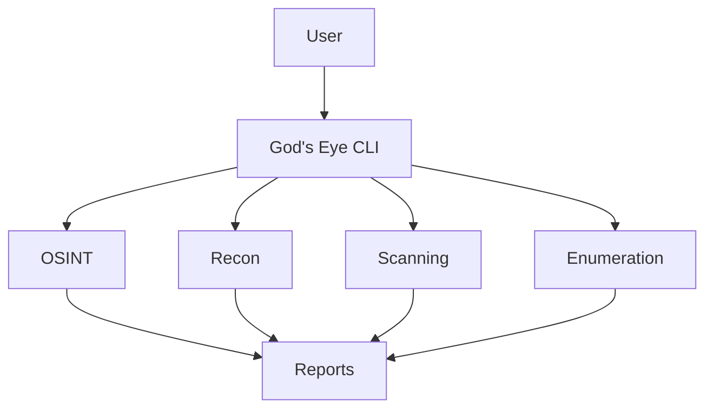

<div align="center">

# 👁️ God's Eye

### *An Advanced OSINT & Cybersecurity Reconnaissance Framework*

<p align="center">
A powerful Python-based toolkit that unifies OSINT, reconnaissance, enumeration, and security assessment into a single interactive command-line interface.
</p>

<p align="center">


</p>

</div>

---

# 📖 Overview

God's Eye is a Python-powered cybersecurity toolkit that combines multiple reconnaissance, OSINT, enumeration, and penetration-testing utilities into one easy-to-use interactive framework.

Instead of switching between numerous security tools manually, God's Eye provides a centralized interface for information gathering and security assessments, making reconnaissance workflows faster and more organized.

---

# ✨ Features

- 🔍 Open Source Intelligence (OSINT)
- 🌐 Network Reconnaissance
- 📡 Subdomain Enumeration
- 🛰️ DNS & WHOIS Lookup
- 🔎 Port & Service Scanning
- 🛡️ Vulnerability Assessment
- 📂 Automated Information Gathering
- ⚙️ Interactive CLI Interface
- 📊 Organized Results
- 🐍 Python-Based Framework

---

# 🏗️ Architecture



---

# 📂 Project Structure

```text
gods_eye/
│
├── assets/
├── docs/
├── modules/
├── requirements.txt
├── install.sh
├── godseye.py
└── README.md
```

---

# 🛠️ Integrated Tools

| Tool | Purpose |
|------|----------|
| Nmap | Network Discovery & Port Scanning |
| Amass | Subdomain Enumeration |
| theHarvester | Email & Domain Intelligence |
| SQLMap | SQL Injection Testing |
| Hydra | Password Auditing |
| Metasploit | Exploitation Framework |

---

# ⚙️ Installation

```bash
git clone https://github.com/CyberSh3ll-oss/gods_eye.git

cd gods_eye

pip install -r requirements.txt

python godseye.py
```

---

# 🚀 Usage

Launch the framework:

```bash
python godseye.py
```

Choose a module from the interactive menu and follow the on-screen instructions.

---

# 📋 Requirements

- Python 3.10+
- Linux (Recommended: Kali Linux)
- Internet Connection
- Git

---

# 🎯 Why God's Eye?

✅ Centralized cybersecurity toolkit

✅ Interactive command-line interface

✅ Multiple reconnaissance modules

✅ Beginner-friendly workflow

✅ Modular & extensible design

✅ Designed for ethical security research

---

# ⚠️ Disclaimer

This project is intended **strictly for educational purposes and authorized security testing**.

Do **NOT** use God's Eye against systems, networks, or applications without explicit permission.

The author assumes **no responsibility** for misuse or damage caused by this software.

---

# 🤝 Contributing

Contributions are welcome!

1. Fork the repository.
2. Create a new branch.
3. Commit your changes.
4. Submit a Pull Request.

Bug reports, feature requests, and improvements are always appreciated.

---

# ⭐ Support

If you found this project useful:

⭐ Star the repository

🍴 Fork the project

🛠️ Contribute improvements

📢 Share it with the cybersecurity community

---

# 📜 License

This project is licensed under the **MIT License**.

---

<div align="center">

## 👁️ God's Eye

**Empowering Ethical Hackers • Security Researchers • OSINT Enthusiasts**

*"See more. Know more. Secure better."*

⭐ **If you like this project, don't forget to leave a Star!**

</div>
